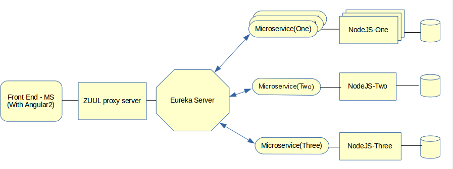

02 - Spring Cloud Zuul

#### O que é




#### Spring Cloud Zuul

- Padrão para a utilização de micro serviços
- Load balancing no lado do servidor
- roteamento dinamico
- Facilidade para geração de logs de acesso
- Totalmente integrado com o Eureka


#### Criando um projeto com Spring Cloud Zuul

1. **Baixe um projeto do https://start.spring.io/**


ou adicione no pom 

```xml
<dependencies>
		<dependency>
			<groupId>org.springframework.cloud</groupId>
			<artifactId>spring-cloud-starter-netflix-eureka-client</artifactId>
		</dependency>
		<dependency>
			<groupId>org.springframework.cloud</groupId>
			<artifactId>spring-cloud-starter-netflix-zuul</artifactId>
		</dependency>

		<dependency>
			<groupId>org.springframework.boot</groupId>
			<artifactId>spring-boot-starter-test</artifactId>
			<scope>test</scope>
		</dependency>
	</dependencies>

	<dependencyManagement>
		<dependencies>
			<dependency>
				<groupId>org.springframework.cloud</groupId>
				<artifactId>spring-cloud-dependencies</artifactId>
				<version>${spring-cloud.version}</version>
				<type>pom</type>
				<scope>import</scope>
			</dependency>
		</dependencies>
	</dependencyManagement>
```


2.  importe com o eclipse
3. Adicione a anotação na classe de aplicação

```java
@EnableZuulProxy
@EnableEurekaClient
@SpringBootApplication
public class ZuulServerApplication {
	public static void main(String[] args) {
		SpringApplication.run(ZuulServerApplication.class, args);
	}
}
```


4. add as propriedades no arquivo `application.yml`

```
spring:
  application:
    name: zuul
  
eureka:
  client:
    serviceUrl:
      defaultZone: ${EUREKA_URI:http://localhost:8761/eureka}
```


